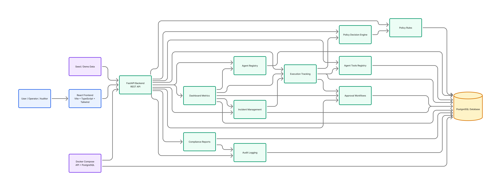

# AgentHQ

Enterprise AI Agent Governance Platform.

AgentHQ provides visibility, governance, approvals, policy enforcement, execution tracking, incident management, auditability, and compliance reporting for AI agents.

## The Problem

Organizations are rapidly deploying AI agents across operations, customer service, knowledge management, and business workflows.

As the number of agents grows, organizations need answers to critical governance questions:

* Which agents exist?
* What tools can they access?
* Which actions require approval?
* Which executions were blocked?
* What incidents occurred?
* How do we audit agent activity?
* How do we generate compliance reports?

## The Solution

AgentHQ provides:

* Agent Registry
* Agent Tools Registry
* Policy Rules
* Policy Decision Engine
* Approval Workflows
* Execution Tracking
* Incident Management
* Audit Logging
* Compliance Reporting
* Dashboard Analytics

## Architecture



AgentHQ uses a React frontend for the governance console, a FastAPI backend for API workflows, modular governance services for policy decisions and lifecycle rules, PostgreSQL persistence for operational records, and audit/compliance capabilities for reporting and review.

## Core Capabilities

* **Agent Registry**: Maintain a catalog of governed agents, ownership, status, department, and risk level.
* **Policy Enforcement**: Evaluate active policy rules to allow, require approval, or block requested actions.
* **Approval Workflows**: Track human approval requests for high-risk or policy-controlled actions.
* **Execution Tracking**: Record simulated agent actions, status, cost, latency, policy decisions, and outcomes.
* **Incident Management**: Capture and resolve incidents related to failed executions, blocked actions, or policy violations.
* **Audit Logging**: Preserve structured before/after audit events across governance workflows.
* **Compliance Reporting**: Generate read-only summaries for auditors and managers.

## Tech Stack

### Backend

* FastAPI
* PostgreSQL
* SQLAlchemy
* Alembic

### Frontend

* React
* TypeScript
* Tailwind CSS
* TanStack Query

### Infrastructure

* Docker Compose
* Supabase PostgreSQL
* Render
* Vercel

## Quality

* 146 automated tests passing
* Ruff clean
* MyPy clean
* Dockerized deployment
* Seed/demo data included

## Repository Structure

```text
backend/
  app/
    api/
    core/
    db/
    models/
    repositories/
    schemas/
    services/
  alembic/
  tests/
  Dockerfile
  pyproject.toml

frontend/
  src/
    api/
    components/
    pages/
    routes/
    types/
  package.json
```

## Docker Demo

Start PostgreSQL and the backend API:

```bash
docker compose up --build
```

The API container runs migrations before starting Uvicorn.

Open API docs:

```text
http://localhost:8000/docs
```

Seed demo data manually:

```bash
docker compose exec api python -m app.seed
```

Stop the stack:

```bash
docker compose down
```

Reset local database data:

```bash
docker compose down -v
```

## Production Deployment

AgentHQ is prepared for a Supabase PostgreSQL, Render backend, and Vercel frontend deployment.

Production configuration is environment-driven:

```text
Backend:  DATABASE_URL, BACKEND_CORS_ORIGINS
Frontend: VITE_API_BASE_URL
```

Use exact HTTPS origins in `BACKEND_CORS_ORIGINS`, keep `DATABASE_URL` in backend secret storage, apply migrations before serving a new version, and never seed production automatically. FastAPI interactive docs remain enabled for this MVP and can be restricted at the edge when needed.

See [DEPLOYMENT.md](DEPLOYMENT.md) for the complete deployment guide.

## Frontend

Install dependencies:

```bash
cd frontend
cp .env.example .env
npm install
```

Run the frontend:

```bash
cd frontend
npm run dev
```

Open:

```text
http://localhost:5173
```

The Vite dev server proxies `/api` requests to `http://localhost:8000` when `VITE_API_BASE_URL` is empty.

Build and lint:

```bash
cd frontend
npm run build
npm run lint
```

## Backend Local Development

Install dependencies:

```bash
cd backend
cp .env.example .env
uv sync
```

Start PostgreSQL only:

```bash
cd ..
docker compose up -d postgres
```

Apply migrations:

```bash
cd backend
uv run alembic upgrade head
```

Seed demo data:

```bash
cd backend
uv run python -m app.seed
```

Run the API locally:

```bash
cd backend
uv run fastapi dev app/main.py
```

Run backend checks:

```bash
cd backend
uv run pytest
uv run ruff check .
uv run mypy app tests
```

Create migrations:

```bash
cd backend
uv run alembic revision --autogenerate -m "describe change"
```

## Demo Flow

1. Start Docker services.
2. Seed demo data.
3. Open the frontend at `http://localhost:5173`.
4. Review the Dashboard summary cards.
5. Open Agents and inspect tools for the Payment Operations Agent.
6. Use Policy Decision Tester with a high-risk action.
7. Create a simulated high-risk execution and observe policy enforcement.
8. Approve a pending approval.
9. Create or resolve an incident.
10. Review Compliance summary and incident report.

See [DEMO.md](DEMO.md) for curl-based examples.

## Screenshots

Screenshots can be added here once the visual demo flow stabilizes:

* Dashboard overview
* Agent detail and tools
* Policy decision tester
* Compliance summary

## Roadmap

Future ideas:

* Authentication & RBAC
* Real Agent Registration
* MCP Server Registration
* Foundry Agent Registration
* Cost Tracking
* Notifications
* Multi-tenancy

## Health Check

```bash
curl http://localhost:8000/health
```
